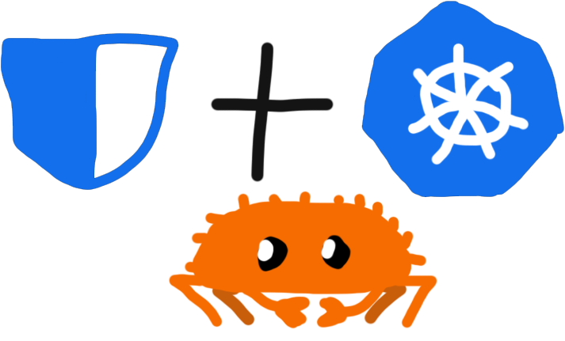

# bitwarden-secret-operator-rs

bitwarden-secret-operator-rs is a kubernetes Operator written in Rust thanks
to [kube-rs](https://kube.rs).

The goal is to create [Kubernetes Secret](https://kubernetes.io/docs/concepts/configuration/secret/) objects while using Bitwarden as the source of truth for your secret values.

It currently is used in production by [OlympusGG](https://github.com/OlympusGG), for our GitOps
powered cluster management.

<p align="center">
  
</p>

> DISCLAIMER:  
> This project wraps the BitWarden CLI as we didn't want to rewrite a client for BitWarden and BitWarden does not offer
> easy to use public client libraries
>
> If you need multi-line (SSH key, Certificate...) like we did, use secure note until BitWarden
> implements [Multiline support](https://community.bitwarden.com/t/add-an-additional-multi-line-text-field/2165)

## Features

- [x] Compatible with original [.NET Bitwarden Operator](https://github.com/OlympusGG/bitwarden-secret-operator)
- [x] Automatically refreshing secrets through `bw sync`
- [x] Supporting: fields/notes
- [x] [Prometheus](https://prometheus.io/) Metrics
- [x] [OpenTelemetry](https://opentelemetry.io/) Traces

## TODOs
- [ ] Unit testing (partially implemented)
- [ ] More metrics/observability

## Getting started

You will need a `ClientID` and `ClientSecret` ([where to get these](https://bitwarden.com/help/personal-api-key/)) as
well as your password.
Expose these to the operator as described in this example:

```yaml
env:
- name: BW_HOST
  value: "https://vaultwarden.yourdomain.ai"
- name: BW_CLIENTID
  value: "user.your-client-id"
- name: BW_CLIENTSECRET
  value: "yourClientSecret"
- name: BW_PASSWORD
  value: "YourSuperSecurePassword"
- name: SECRET_REFRESH_RATE # optional, by default it's 15 seconds, this value is to define how frequently `bw sync` is called
  value: "00:00:30" # TimeSpan (hh:mm:ss)
- name: OPENTELEMETRY_ENDPOINT_URL
  value: "otel-collector.namespace.svc.cluster.local"
- name: METRICS_ENDPOINT
  value: "127.0.0.1:3001"
```

the helm template will use all environment variables from this secret, so make sure to prepare this secret with the key
value pairs as described above.

`BW_HOST` can be omitted if you are using the Bitwarden SaaS offering.

After that it is a basic helm deployment:

```bash
helm repo add bitwarden-operator https://blowaxd.github.io/bitwarden-secret-operator-rs
helm repo update 
kubectl create namespace bw-operator
helm upgrade --install --namespace bw-operator -f values.yaml bw-operator bitwarden-operator/bitwarden-secret-operator-rs
```

## BitwardenSecret

And you are set to create your first secret using this operator. For that you need to add a CRD Object like this to your cluster:

```yaml
---
apiVersion: bitwarden-secret-operator-rs.io/v1beta1
kind: BitwardenSecret
metadata:
  name: my-secret-from-bitwarden
spec:
  name: "my-secret-from-spec" # optional, will use the same name as CRD if not specified
  namespace: "my-namespace" # optional, will use the same namespace as CRD if not specified
  labels: # optional set of labels
    here-my-label-1: test
  type: "kubernetes.io/tls" # optional, will use `Opaque` by default
  bitwardenId: 00000000-0000-0000-0000-000000000000 # optional, this id applies to all elements without `bitwardenId` specified 
  content: # required, array of objects
  - bitwardenId: d4ff5941-53a4-4622-9385-2fcf910ae7e7 # optional, can be specified for a specific secret
    bitwardenSecretField: myBitwardenField # optional, mutually exclusive with `bitwardenSecretField` but acts as a second choice
    bitwardenUseNote: false # optional, mutually exclusive and prioritized over `bitwardenSecretField`
    kubernetesSecretKey: MY_KUBERNETES_SECRET_KEY # required
    kubernetesSecretValue: value # optional, alternative to stringData
  - bitwardenUseNote: true # boolean, exclusive and prioritized over `bitwardenSecretField`
    kubernetesSecretKey: MY_KUBERNETES_SECRET_KEY # required
  stringData: # optional, string data
    test: hello-world
```

## Generating the CRD

Use this command to output the CRD if you need to modify it
```shell
cargo run --example crd
```

## Credits/Thanks

- [Bitwarden](https://bitwarden.com/) for their product
- [kube-rs](https://kube.rs) For their work on `kube-rs`
